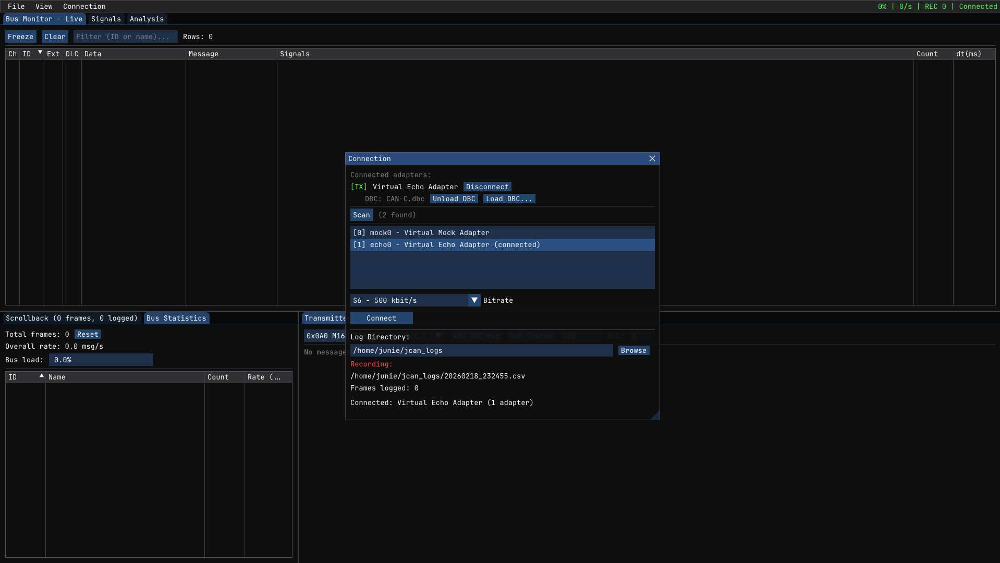

# jcan

can bus diagnostic tool for linux. reverse-engineered usb protocol for vector hardware, socketcan, slcan serial adapters, dbc decoding, logging, transmit scheduling. written in c++23 with dear imgui.


## what is this

a can bus tool i built because the existing options on linux are either ancient, proprietary, or both. or they simply dont exist. supports multiple adapters simultaneously, decodes dbc files in real time, and includes what is (to my knowledge) the first open-source linux driver for vector can hardware.

the vector vn1640a driver was reverse-engineered entirely from the windows kernel driver `vn1640.sys` using ida.



## the reverse engineering

### vector vn1640a

vector's can interfaces are industry standard in automotive and basically every oem and tier-1 uses them. but vector only ships windows drivers and charges for their xl driver library. there is zero linux support.

so i reverse engineered the full usb protocol:

**usb endpoint map**:

| endpoint | direction | purpose           |
| -------- | --------- | ----------------- |
| `0x01`   | out       | command channel   |
| `0x82`   | in        | command responses |
| `0x03`   | out       | can tx data       |
| `0x84`   | in        | tx flow control   |
| `0x85`   | in        | can rx data       |

every command is `{u32 total_size, u32 cmd_id, payload[]}` little-endian. the device overwrites the same buffer with the response. 21 commands documented, covering bootloader ops, firmware/fpga management, can channel control, and transceiver configuration.

init sequence from `vnCDrvIFCardSetup`:

1. query bootcode info -> upload main firmware (~631kb, 972-byte chunks) -> poll until firmware boots (retry loop, 100ms intervals like the windows driver)
2. upload fpga bitstream (~1.5mb, same chunking)
3. set rx event transfer mode -> query transceiver info -> poll rx endpoint for transceiver event (up to 5s, matching the windows driver's timeout)
4. start firmware -> read fpga core clock -> compute can bit timing from clock frequency
5. configure channel: output mode -> chip params (bitrate + timing via `SetChipParamFdXl` @ `0x140054B40`) -> transceiver mode -> activate

the firmware blobs are embedded directly into the binary via gas `.incbin`.

**can bit timing**: sweeps tq/bit from 80 down to 8, targets 80% sample point, verifies exact integer prescaler from the fpga core clock. sjw = min(tseg2, 16). the `SetChipParamFdXl` command layout is a 104-byte struct i mapped out field-by-field from the decompiled `canCmdSetChipParamFdXl`.

**rx event parsing**: events arrive packed and 4-byte aligned on the rx bulk endpoint. they can span usb transfer boundaries (partial event reassembly is implemented). classic can events are 56 bytes with data at offset `0x28`; fd events are 128 bytes with data at offset `0x40`. 12 event tags documented including `FW_CANFD_RX_OK`, `TX_OK`, `BUS_STATISTIC`, `ERR_COUNTER`, etc.

**tx format** (from decompiled `canTransmitFd`): `{u32 size, u16 reserved, u16 tag=0x0440, u32 user_handle, u32 msg_ctrl, u32 can_id, u8 tx_attempts, u8[3] pad, u8 data[64]}` on endpoint `0x03`.

### tools used

- ida pro - static analysis of `vn1640.sys` (windows x64 kernel driver)
- wireshark + usbpcap - usb packet captures against the windows xl driver library for protocol validation
- libusb - userspace usb access on linux

## supported hardware

| adapter                            | interface      | notes                                                  |
| ---------------------------------- | -------------- | ------------------------------------------------------ |
| vector vn1640a                     | usb (libusb)   | reverse-engineered, see above                          |
| kvaser (any socketcan-supported)   | socketcan      | auto-configures bitrate and link state, sudo elevation |
| canadapter / cantact / candlelight | slcan (serial) | ascii protocol over usb-serial                         |
| any socketcan device               | socketcan      | `can0`, `vcan0`, etc.                                  |

adapter discovery scans serial ports (vid/pid matching for 8 known adapters), socketcan interfaces via netlink, and usb sysfs for vector/peak/kvaser devices. unbound usb devices get helpful hints.

## build

requires cmake 3.25+ and a c++23 compiler (gcc 13+ or clang 17+).

```bash
cmake -B build
cmake --build build -j$(nproc)
```

system dependencies:

- `libusb-1.0` (optional - needed for vector adapter, auto-detected via pkg-config)
- opengl headers + drivers

conditional features:

- `JCAN_ENABLE_SOCKETCAN` - auto-enabled on linux
- `JCAN_ENABLE_VECTOR` - auto-enabled if libusb is found

## run

```bash
./build/jcan_gui          # full gui
./build/jcan_cli          # headless frame dump
```

## keyboard shortcuts

| key      | action               |
| -------- | -------------------- |
| `Ctrl+O` | open dbc file        |
| `Ctrl+R` | start/stop recording |
| `Ctrl+Q` | quit                 |
